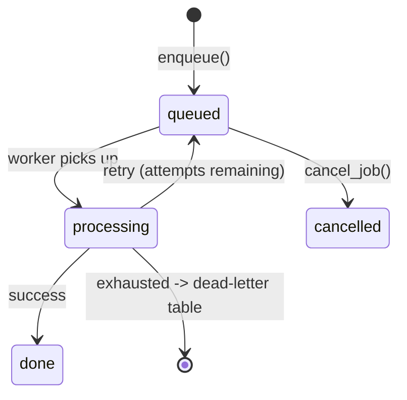

# 1. Defining jobs

> **Beginner** - 5 minutes. The decorator, enqueueing, and what a job actually is.

A job is a Python function that runs in the background. You define it with a decorator, enqueue it with arguments, and a worker picks it up and runs it.

## Defining a job

```python
from soniq import Soniq

app = Soniq(database_url="postgresql://localhost/myapp")

@app.job()
async def send_welcome_email(user_id: int, template: str = "default"):
    user = await get_user(user_id)
    await send_email(user.email, template)
```

That is it. The `@app.job` decorator registers the function so Soniq knows about it. The function itself is a normal `async def` - you can call it directly in tests, or you can enqueue it as a background job.

By default Soniq derives the *task name* (the string identifier under which the job is registered) from `f"{module}.{qualname}"`. The function above registers as `myapp.tasks.send_welcome_email` - the same convention Celery uses.

## Enqueuing a job

```python
job_id = await app.enqueue(send_welcome_email, user_id=42)
```

`enqueue` writes a row into Soniq's job table. The next available worker will claim that row, run `send_welcome_email(user_id=42)`, and mark the row done.

A few things to notice:

- `enqueue` is a coroutine. You have to `await` it. (If you forget, Python will warn you with `RuntimeWarning: coroutine was never awaited`.)
- Arguments are keyword-only. There is no `enqueue(send_welcome_email, 42)`; it is always `user_id=42`. This makes job calls self-documenting and migration-safe - reordering parameters in your function does not silently break enqueued jobs.
- `enqueue` returns a job id you can use later to check status or cancel.

## Job status lifecycle

Every enqueued job lives in one of these states:



You can check a job's status at any time:

```python
job = await app.get_job(job_id)
print(job["status"])   # "queued", "processing", "done", "cancelled"

result = await app.get_result(job_id)  # return value of a completed job
```

The "exhausted" arrow points to the **dead-letter queue** - a separate table (`soniq_dead_letter_jobs`) that holds jobs that failed every retry. Think of it as a holding area you can inspect and replay from. Retries themselves are covered in [chapter 3](03-retries.md).

### Managing jobs

```python
await app.cancel_job(job_id)    # cancel a queued job
await app.delete_job(job_id)    # remove a job entirely
await app.list_jobs(queue="billing", status="queued", limit=20)
```

To re-run a job whose retries have been exhausted, replay it from the dead-letter table:

```python
new_job_id = await app.dead_letter.replay(job_id)
```

## Going further

The rest of this page covers features you can come back to later. The basics above are enough to keep working through the tutorial.

### Decorator options at a glance

`@app.job` accepts several optional parameters - timeout, priority, retry settings, deduplication, argument validation. Each shows up later in the tutorial when it matters. The full list lives in the [Jobs API reference](../api/jobs.md).

The empty-parens form `@app.job()` is identical to `@app.job` - you will see it in code that started without arguments and later grew them.

### Explicit task names (for cross-service setups)

The default module-derived name (`myapp.tasks.send_welcome_email`) is fine inside a single repo. If you have a producer service and a consumer service in different codebases, set the name explicitly so renaming the function does not break the wire protocol:

```python
@app.job(name="users.send_welcome_email")
async def send_welcome_email(user_id: int, template: str = "default"):
    ...
```

The producer can then enqueue the job by string name, without importing the consumer's code:

```python
await app.enqueue("users.send_welcome_email", args={"user_id": 42})
```

There is also a typed `TaskRef` form. See [cross-service jobs](../guides/cross-service-jobs.md) for the full picture.

### Per-enqueue overrides

You can override decorator defaults at enqueue time:

```python
job_id = await app.enqueue(
    send_welcome_email,
    user_id=42,
    priority=1,          # override priority for this run
    queue="urgent",      # route to a different queue
    unique=True,         # deduplicate this specific enqueue
)
```

### JobContext: runtime metadata in your handler

Add a parameter typed as `JobContext` and Soniq injects metadata about the running job - id, attempt number, worker, queue:

```python
from soniq import JobContext

@app.job()
async def process_invoice(invoice_id: str, ctx: JobContext):
    print(f"Job {ctx.job_id}, attempt {ctx.attempt} of {ctx.max_attempts}")
```

Useful for logging, structured tracing, and conditional logic on retry attempts. Full field list in the [Jobs API reference](../api/jobs.md#jobcontext).

### Argument validation with Pydantic

Pass a Pydantic model as `validate=` to reject bad arguments at enqueue time, instead of letting the job fail in a worker:

```python
from pydantic import BaseModel

class EmailArgs(BaseModel):
    user_id: int
    template: str = "default"

@app.job(validate=EmailArgs)
async def send_welcome_email(user_id: int, template: str = "default"):
    ...

# Raises a validation error at the call site - the job never enqueues.
await app.enqueue(send_welcome_email, user_id="not_an_int")
```

### Transactional enqueue (preview)

You can enqueue a job inside the same database transaction as your business write. If the transaction rolls back, the job is never created.

```python
async with app.backend.acquire() as conn:
    async with conn.transaction():
        await conn.execute("INSERT INTO orders ...")
        await app.enqueue(send_welcome_email, connection=conn, user_id=42)
```

This pattern gets a chapter to itself - see [chapter 6](06-transactional-enqueue.md).
